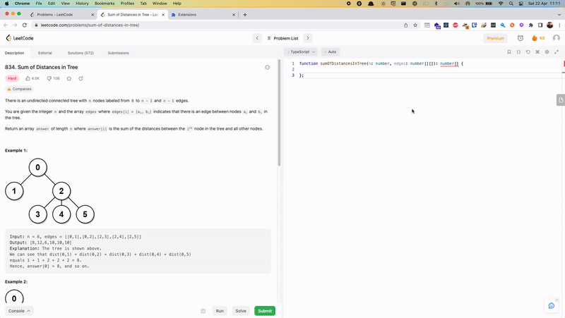

# LeetCodeGPT

**LeetCodeGPT** is a Chrome extension that integrates GPT _(Generative Pre-trained Transformer)_ into the [LeetCode](https://leetcode.com), allowing users to automatically solve LeetCode problems with the click of a button.

## 🚀 Features

- [x] Auto solve problems

### 💪 Roadmap

- [ ] Add Advanced hint
- [ ] Publish to Chrome Web store

## Installation

To install the extension, follow these steps:

1. Download the extension from [beta/leetcode-gpt-0.0.1.zip](beta/leetcode-gpt-0.0.1.zip).
2. Unzip the downloaded extension.
3. Open Google Chrome and go to the Extensions page.
4. Enable `Developer mode`.
5. Click on `Load unpacked` and select the unzipped extension files.

After installing the extension, you will need to set your `OpenAI API Key` in the extension settings. To do this, click on the extension icon in the top right corner of your browser window.

In the extension page, enter your `OpenAI API Key` and choose the `OpenAI Model` you want to use and click `Save`.

You can now use the extension to solve LeetCode problems.

## Usage

Once the extension is installed and your API Key is set, go to the [LeetCode](https://leetcode.com/problemset/all/) website and navigate to the problem that you want to solve. The extension will add a `Solve` button next to the `Submit` button to the problem page.

Clicking the `Solve` button will prompt the extension to use **OpenAI** to generate a solution to the problem. The generated solution will be automatically added to the code section.

## License

This project is licensed under the MIT License - see the [LICENSE](LICENSE) file for details.

## Acknowledgments

**LeetCodeGPT** was created using the OpenAI GPT APIs and was inspired by similar projects that use AI to solve programming problems.

If you have any questions or feedback, please feel free to contact us. Thank you for using **LeetCodeGPT**!
